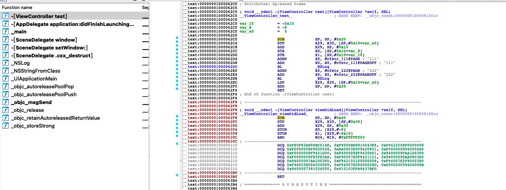
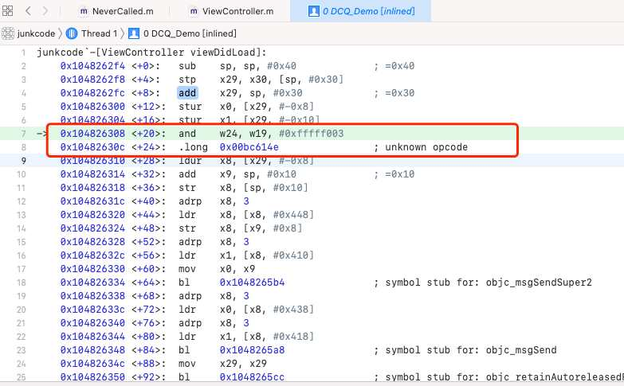
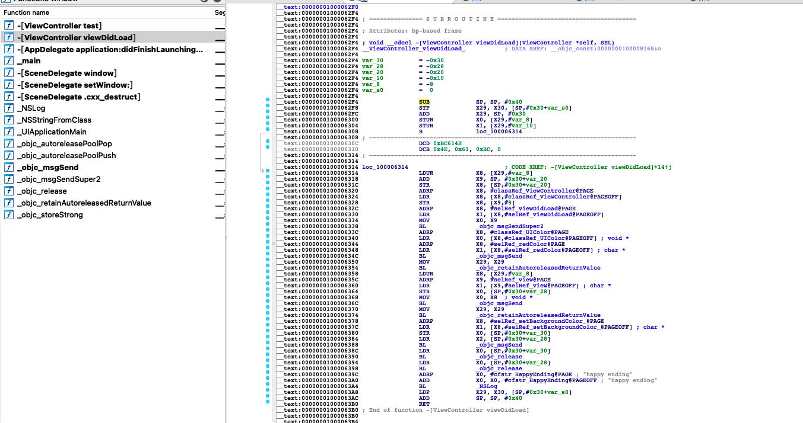
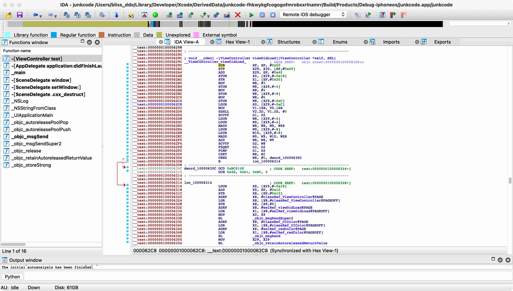
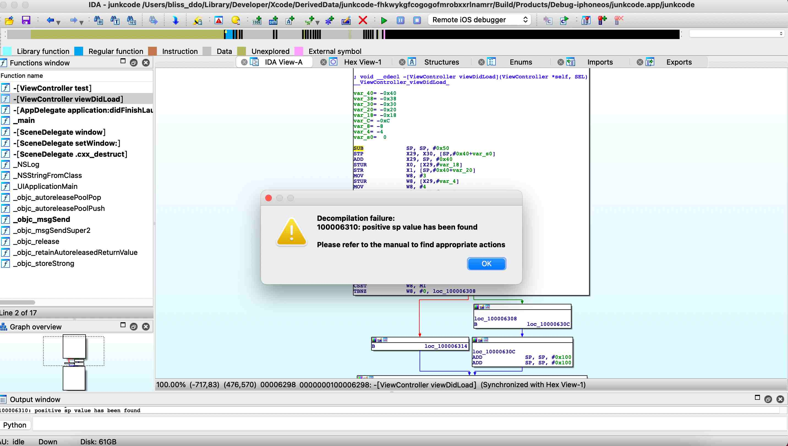
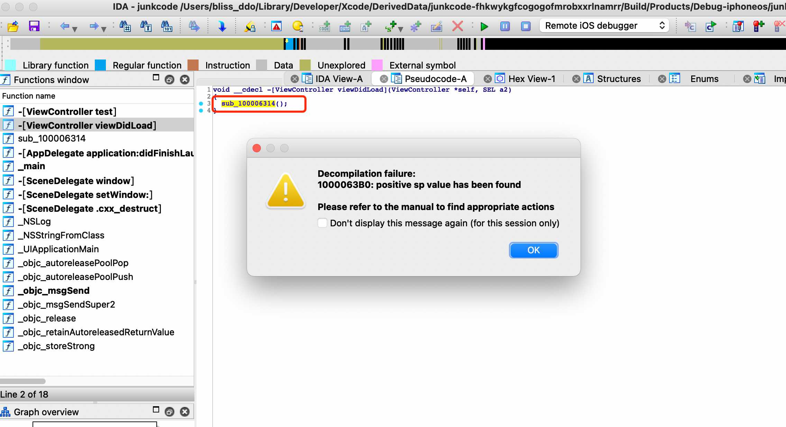
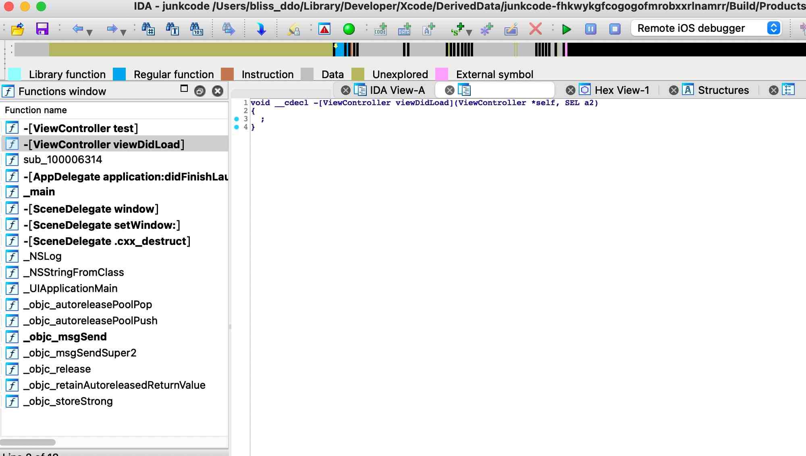

# Anti-Disassembly on ARM64

在ARM64平台，使用内联汇编对抗反汇编器的技巧。

## 先来一段DCB/DCW/DWD/DCQ

[ARM文档如是说](https://developer.arm.com/documentation/dui0473/m/directives-reference/dcb?lang=en)

> The `DCB` directive allocates one or more bytes of memory, and defines the initial runtime contents of the memory.

DCB(DCW/DCD/DCQ同理)伪指令开辟一个字节或者多个字节的内存，并且定义了内存的初始值。

B = byte,W= word  (2bytes),D = dword(4bytes),Q = qword(8bytes)

并且ARM很贴心的给了一个正常示例:

```shell
C_string   DCB  "C_string",0
```

很通俗的理解就是DCQ是汇编语言里为了方便(字符串)常量定义和赋值的指令。既然是数据定义，那么指令出现在可读可写的数据段才更合理。正常人和正常的编译器是不会把DCQ放到只读的代码段的，但是不怎么正常的逆向(安全)工程师会这样做。既然我们知道DCQ是一段数据，那么我们就可以用内联汇编来构造一段DCQ。直接用.long后边跟上任意四字节，我这里就写了两个`12345678`和`0x12345678`,写`0xdeadbeef`也可以。用Xcode new一个demo，并把下边的代码贴到demo里。

```
static __attribute__((always_inline)) void DCQ_Demo() {
#ifdef __arm64__
    __asm__(
            ".long 0x12345678\n"
            ".long 12345678\n" 
            );
#endif
}
```

clean，build，product扔到IDA里。熟悉的DCQ来了，这两个.long把后边的解析直接带跑偏了，IDA不解析了。



再来看看动态的Xcode，第一个.long `0x12345678`被解析成了正常的汇编代码。第二个`12345678`无法识别，因此注释了`unknow opcode`。先别着急往下看，大家可以猜想一下放开断点之后会发生什么？



第一个0x12345678被解析成了正常的汇编代码。实际执行过程中改变了w24寄存器的值，由于上下文都没引用到w24,所以在这段程序里这行代码没有产生任何负面效果。再来看第二个12345678也就是`unknown opcode`。cpu执行到这行，由于无法识别这段代码，所以直接抛出异常，程序崩溃了。

**小结：DCQ是一条正常的汇编伪指令，用来声明内存并赋初始值。代码段(可读可执行，不可写)的DCQ可以用来声明数据。生成的垃圾指令无法被IDA正常解析也无法被xcode识别执行。结合其他指令可以用来做代码混淆。**

## B指令+DCQ

第一段我们已经知道了DCQ是什么，并且可以用内联汇编构造出DCQ。但是DCQ本质上是一段数据(指令)，能被正常解析成指令的话，运行时会产生不可预知的效果，不能被解析成指令的话，cpu直接抛出异常。

如何能构造出DCQ又能让程序正常运行呢？ 可以用B指令，“跨过”那两条不能被正常执行的指令。这样DCQ迷惑了反汇编器，B指令又跨过了这些错误的指令。

用内联汇编怎么写B指令呢？

[来看一下ARM文档B指令](https://developer.arm.com/documentation/ddi0596/2021-06/Base-Instructions/B--Branch-?lang=en)

> ## B
>
> Branch causes an unconditional branch to a label at a PC-relative offset, with a hint that this is not a subroutine call or return.

蹩脚翻译：

1. B是无条件跳转，那啥是有条件？请君自学
2. B是相对跳转，既然相对了，那么参照物是啥？ PC-relative . 
3. B跳转不是调用子函数，所以没return。意思是不像BL,跳过去会把LR变了。

**写给菜鸟，大佬跳过：**

PC是program counter，程序计数器。每条指令执行完会+1，增加一个单位，也就是四字节。

众所周知操作系统加载程序会带上ASLR,也就是说每次程序加载地址都不一样，同样一段代码每次执行的PC值都不一样。但这并不会影响到B这种相对地址跳转。我们只要把相对地址固定好就行。

```shell
0x100000000 b 0xc # 当前PC = 0x100000000, 所以B的目的地址 = 0x100000000 + 0xc 也就是直接跳到C那里
0x100000004 A
0x100000008 B
0x10000000c C
0x100000010 D
0x100000014 E
```

所以用B跨过了那些迷惑反汇编器的指令。下边代码可以被插入到程序的任何地方。因为仅仅是多了一条b，没有对寄存器的占用,所以不会对程序逻辑产生任何影响。B之间的0x12345678可以被任意替换，填充的长度也可以被任意替换。B后边的操作数 = (填充代码的长度+1) * 4 。比如下边这条，填充了两条，所以B后边的操作数就是(2 + 1)* 4 = 12也就是0xc。

```shell
static __attribute__((always_inline)) void B_DCQ_Demo() {
#ifdef __arm64__
    __asm__(
            "b 0xc\n"
            ".long 12345678\n"
            ".long 12345678\n"
            );
#endif
}
```

再看IDA




细心的你也许会发现，同样是两条.long ,为啥图一后边的代码都是DCQ,而这张图上却仅仅有两条呢？以下是我的猜测。

反汇编器的扫描策略大致可以分为两种：线性扫描和递归下降扫描(flow-oriented) 。线性扫描当然很好理解，就是逐条的扫。但是线性扫描对指令长度是有要求的，固定长度的扫下来才不会出错(说实话我觉得对于ARM64这种4指令固定长度的，线性扫描真的挺合适的) 。 Intel x86指令是变长的，ARM32也能切到16bit的thumb模式，上述平台线性扫描就不适用。就像考试抄袭学霸的答题卡，一旦抄错位一个，后边的就都错了。

所以主流的反汇编器都使用flow-oriented的扫描模式。所以我们可以先看一下图二，反汇编进行到B指令，程序流产生了分叉，所以IDA选择从B的目的地址接着扫。最后中间被跨过去的部分就没被扫到，也就比较原始的形式留在那里了。那么图一呢？ 扫到了错误的指令之后，IDA直接停止了对当前流的扫描，直接返回到上个分叉的地方继续扫，那么上个分叉的地方是哪里？ 如果猜测正确的话，上个分叉的地方是下一个函数。

以上仅为猜测，也不是本文重点，希望不要误导。当然技多不压身，多了解一点反编译原理更有助于我们写出对抗代码。

## 虚假控制流+DCQ

DCQ迷惑了IDA但运行时会让程序崩溃, B跨过去可以规避问题，但却让迷惑效果打折。除了B有没有更好的办法？ 当然有，把DCQ放到永远都不会被执行的分支里。也就是所谓的虚假控制流BogonControlFlow。

先来看一下如何构造虚假控制流。构造虚假控制流是一个非常常用的技巧。有各种各样花式技巧。构造虚假控制流最需要考虑的是，构造出来的谓词不要被聪明的编译器给优化掉(比如常量折叠之类的)。 举几个常见的例子，x是整数 (x+1)(x+2) % 2 一定等于 0，同理 (x+1)(x+2)(x+3) % 3也一定等于0。把上述一定成立的结论取个反，就成了恒为假的条件。

下面示例用勾股数来构造一个虚假控制流。勾三股四弦五，那咱搞个弦六，够虚假了吧。开方运算sqrt在math.h里，不会被编译器优化。代码里的变量名比较随便，如果想在生产写这种代码，记得把abc换成不容易撞车的变量名。

```shell
static __attribute__((always_inline)) void BogonControlFlow_DCQ_Demo() {
#ifdef __arm64__
    int a = 3;
    int b = 4;
    int c = 6;
    if (c < sqrt(a*a+b*b)) {
        __asm__(
                ".long 12345678\n"
                ".long 12345678\n"
                );
    }
#endif
}
```

把脏指令扔到了虚假控制流里，迷惑了IDA,左侧的函数列表里甚至都看不到viewDidLoad的函数名了。右侧的汇编页面也变红了，没法F5了。




## B+虚假控制流+DCQ

有了虚假控制流和DCQ的加持，可以构造出混淆case了。在虚假控制流里，可以随意折腾任何指令。这次把B指令也加上，直接B到脏指令上。虽然IDA看起来与上文无异，但是我们可以把这个case拓展一下，变成另外一种混淆即堆栈不平衡。

```shell
static __attribute__((always_inline)) void B_BogonControlFlow_DCQ_Demo() {
#ifdef __arm64__
    int a = 3;
    int b = 4;
    int c = 6;
    if (c < sqrt(a*a+b*b)) {
        __asm__(
                "b 0x4\n"
                ".long 12345678\n"
                );
    }
#endif
}
```


## B+虚假控制流+堆栈不平衡

```shell
static __attribute__((always_inline)) void B_BogonControlFlow_ADD_SP() {
#ifdef __arm64__
    int a = 3;
    int b = 4;
    int c = 6;
    if (c < sqrt(a*a+b*b)) {
        __asm__(
                "b 0x4\n"
                "add sp,sp,#0x100\n"
                "add sp,sp,#0x100\n"
                );
    }
#endif
}
```

程序运行在栈上，栈从上往下生长(满递减，高地址向低地址生长。表述不同，其实都一个意思)。所以开辟空间就是减sub sp sp 0x1234, 回收空间就是加add sp sp 0x1234.开辟和回收的空间一定相等。如果不相等会怎样？ 上边在虚假控制流里把sp加了一些，所以IDA分析的时候，直接导致了堆栈不平衡，没法F5了。




## 用BR实现间接跳转

核心思想：把要跳转的地址藏到BR后边的寄存器里。因为IDA是静态反汇编器。反汇编过程中不会计算

[先看官方解释](https://developer.arm.com/documentation/ddi0596/2021-06/Base-Instructions/BR--Branch-to-Register-?lang=en)

> ## BR
>
> Branch to Register branches unconditionally to an address in a register, with a hint that this is not a subroutine return.

直接上代码，把要跳转的地址藏到寄存器里。静态分析无法获取寄存器的运行时的值，所以会让分析停下来。

最关键的是，如何能在br之前获取到紧接着br的一条地址。同样先用地址无关的ADR指令，把紧接着br指令的地址算出来，并把地址“藏”到x8寄存器里，直接用br跳过去。这样就实现了最简单的间接跳转。

```shell
static __attribute__((always_inline)) void BR_2_X8() {
#ifdef __arm64__
    __asm__(
            "mov x8,#0x1\n"
            "adr x9, #0x10\n"
            "mul x8, x9, x8\n"
            ".long 0x12345678\n"
            "br x8\n"
            );
#endif
}
```





## RET TO SELF

这是一个比较有趣的技巧。我把它命名成ret to self。前文已经说过IDA是面向流的扫描方式，所以如果程序里如果不出现任何流(也就是不出现任何跳转指令B，BR,BL,BLR等)。那么IDA会一直线性扫描到函数结尾。换句话说，我们构造一种case，让IDA线性的扫描到ret以为函数已经结束。

直接看代码吧。第一条，用adr计算出了紧跟着ret指令后一条的pc地址。第二条，把这个地址放到x30寄存器里。为什么要这么做？

```shell
static __attribute__((always_inline)) void RET_2_SELF() {
#ifdef __arm64__
    __asm__(
            "adr x8,#0xc\n"
            "mov x30,x8\n"
            "ret\n"
            );
#endif
}
```

来看一下RET指令

> ## RET
>
> Return from subroutine branches unconditionally to an address in a register, with a hint that this is a subroutine return.

在a函数里调用了b，b在return的时候发生了什么？ 当然是返回到a函数的调用处的下一条。调用处下一条的地址存在哪里？当然是LR寄存器里。LR寄存器是什么？当然是x30了。

所以ret指令有一条“等价”写法 ==> `mov pc lr`。

再看上面的代码就很明显了，ret之后实际是跳到了自己后面继续执行。所以叫ret to self没毛病把。

再看IDA，成功被骗。IDA没扫到任何流，线性的撞到了ret上，所以以为函数已经结束了。F5之后得到一个空函数。




# 最后

谢谢收看。点个赞/star。